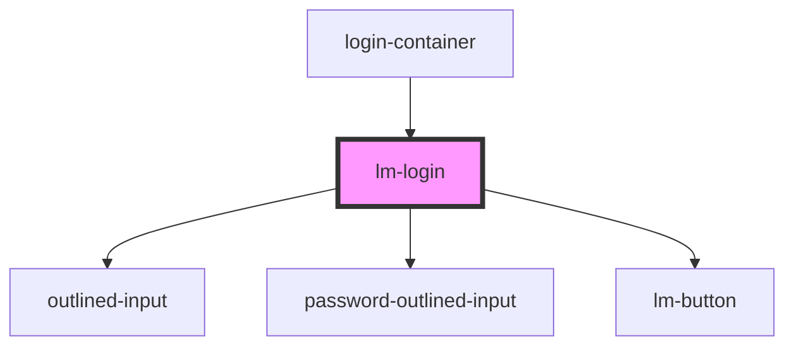

# lm-login

<!-- Auto Generated Below -->

## Properties

| Property | Attribute | Description | Type    | Default     |
| -------- | --------- | ----------- | ------- | ----------- |
| `form`   | --        | Props below | `any[]` | `undefined` |

## Events

| Event         | Description | Type                   |
| ------------- | ----------- | ---------------------- |
| `handleLogin` |             | `CustomEvent<unknown>` |

## Dependencies

### Used by

 - [login-container](..)

### Depends on

- [outlined-input](../../outlined-input)
- [password-outlined-input](../../password-outlined-input)
- [lm-button](../../lm-button)

### Graph

----------------------------------------------

*Built with [StencilJS](https://stenciljs.com/)*
