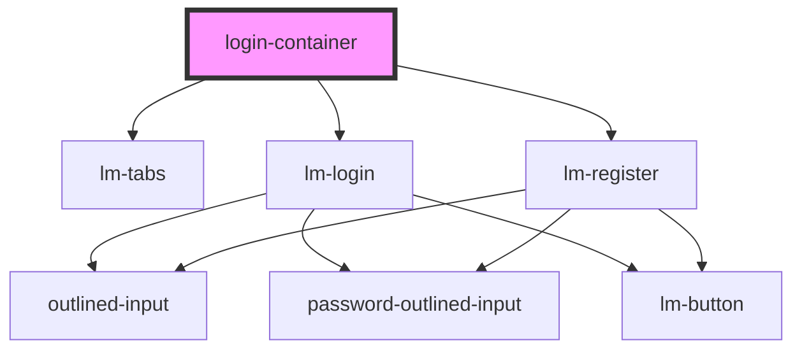

# my-component

<!-- Auto Generated Below -->

## Events

| Event         | Description | Type                   |
| ------------- | ----------- | ---------------------- |
| `handleLogin` | Props below | `CustomEvent<unknown>` |

## Dependencies

### Depends on

- [lm-tabs](../lm-tabs)
- [lm-login](login)
- [lm-register](register)

### Graph

----------------------------------------------

*Built with [StencilJS](https://stenciljs.com/)*
