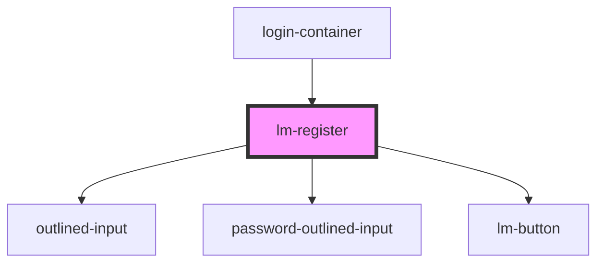

# lm-register

<!-- Auto Generated Below -->

## Events

| Event         | Description | Type                   |
| ------------- | ----------- | ---------------------- |
| `handleLogin` | Props below | `CustomEvent<unknown>` |

## Dependencies

### Used by

 - [login-container](..)

### Depends on

- [outlined-input](../../outlined-input)
- [password-outlined-input](../../password-outlined-input)
- [lm-button](../../lm-button)

### Graph

----------------------------------------------

*Built with [StencilJS](https://stenciljs.com/)*
