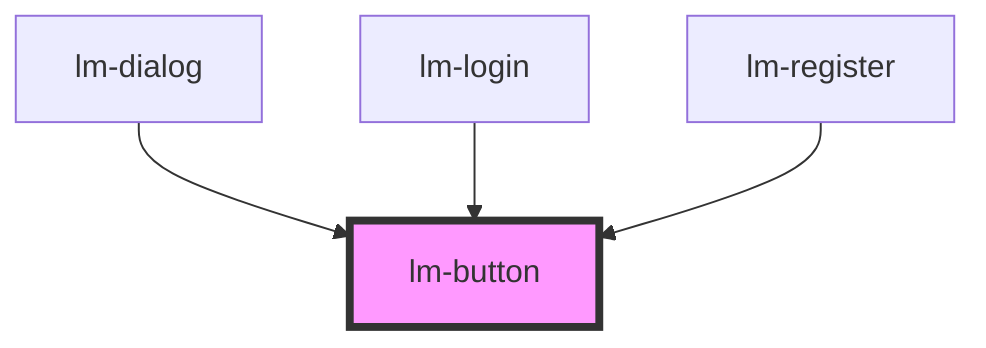

# lm-button

<!-- Auto Generated Below -->

## Properties

| Property | Attribute | Description | Type     | Default     |
| -------- | --------- | ----------- | -------- | ----------- |
| `color`  | `color`   |             | `string` | `'primary'` |
| `type`   | `type`    |             | `string` | `''`        |

## Events

| Event         | Description | Type                   |
| ------------- | ----------- | ---------------------- |
| `handleClick` |             | `CustomEvent<unknown>` |

## Dependencies

### Used by

 - [lm-dialog](../lm-dialog)
 - [lm-login](../auth-container/login)
 - [lm-register](../auth-container/register)

### Graph

----------------------------------------------

*Built with [StencilJS](https://stenciljs.com/)*
