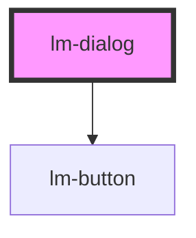

# lm-dialog

<!-- Auto Generated Below -->

## Properties

| Property            | Attribute             | Description | Type      | Default     |
| ------------------- | --------------------- | ----------- | --------- | ----------- |
| `modalTitle`        | `modal-title`         |             | `string`  | `undefined` |
| `showCancelButton`  | `show-cancel-button`  |             | `boolean` | `true`      |
| `showCloseButton`   | `show-close-button`   |             | `boolean` | `true`      |
| `showConfirmButton` | `show-confirm-button` |             | `boolean` | `true`      |
| `type`              | `type`                |             | `string`  | `'info'`    |

## Dependencies

### Depends on

- [lm-button](../lm-button)

### Graph

----------------------------------------------

*Built with [StencilJS](https://stenciljs.com/)*
