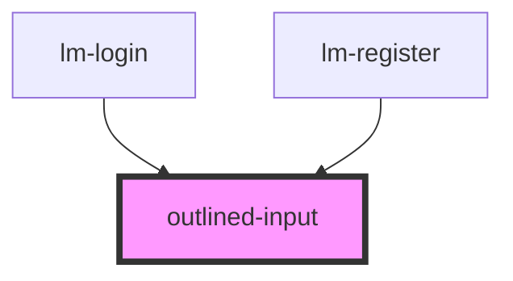

# outlined-input

<!-- Auto Generated Below -->

## Properties

| Property      | Attribute     | Description | Type     | Default         |
| ------------- | ------------- | ----------- | -------- | --------------- |
| `placeholder` | `placeholder` |             | `string` | `'Placeholder'` |
| `type`        | `type`        |             | `string` | `'text'`        |
| `value`       | `value`       |             | `string` | `""`            |

## Events

| Event         | Description | Type                  |
| ------------- | ----------- | --------------------- |
| `changeInput` |             | `CustomEvent<string>` |

## Dependencies

### Used by

 - [lm-login](../auth-container/login)
 - [lm-register](../auth-container/register)

### Graph

----------------------------------------------

*Built with [StencilJS](https://stenciljs.com/)*
